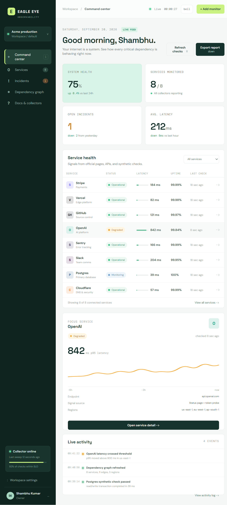

# Eagle Eye Observability

Eagle Eye is a GitHub-friendly SaaS and web-services observability control room. It models service dependencies, combines multiple health signals, and makes the operational picture easy to scan.

## What is included

- Live dashboard polling with service health, latency, uptime, and incident signals
- Service filtering and focus details for connected dependencies
- Dependency graph view for tracing impact across your system
- Incident view with an evidence stack for official, synthetic, and community signals
- In-product collector and deployment documentation
- GitHub Pages deployment workflow in `.github/workflows/deploy.yml`
- Private access and RBAC deployment guidance in `ACCESS_CONTROL.md`
- Scheduled public status collection via `scripts/collect-status.mjs`
- Product/IP notices in `NOTICE.md`

The current UI uses a deterministic local signal set so it runs safely as a static GitHub Pages site. This is intentional: browser-only apps cannot safely hold private API keys, and many vendor APIs do not allow cross-origin requests. The collector contract below is the extension point for a small server-side worker.

## The distinctive idea

Eagle Eye is built around **Signal Constellation**: an evidence-weighted dependency graph that fuses official status pages, direct probes, synthetic journeys, public corroboration, and application telemetry. It preserves uncertainty when a source is missing, then explains which product path is most likely affected and why. This is the public product description; detailed invention records, claims, diagrams, experiments, and filing strategy stay outside this public repository.

## Run locally

Requires Node.js 20 or newer.

```bash
npm install
npm run dev
```

Production build:

```bash
npm run build
npm run preview
```

## Connecting real services

Create a server-side collector for each vendor or internal system. Keep credentials in GitHub Actions secrets, a managed secret store, or your runtime environment. Normalize each observation before sending it to the dashboard API:

```ts
type Signal = {
	service: string
	status: 'up' | 'down' | 'degraded'
	latencyMs: number
	observedAt: string
	source: 'official' | 'api' | 'synthetic' | 'community'
	region?: string
	evidenceUrl?: string
}
```

Useful collector targets include vendor status pages and APIs, HTTP/TCP/DNS probes, synthetic user journeys, GitHub webhooks, Sentry events, public DNS health checks, and public incident aggregators. Keep third-party requests behind the collector so the browser only receives normalized health facts.

## GitHub Pages

1. Push the repository to GitHub with the default branch named `main`.
2. In repository settings, open **Pages** and select **GitHub Actions** as the source.
3. Push a change. The included workflow installs dependencies, builds `dist`, and publishes the dashboard.

### Private access and roles

Standard public GitHub Pages cannot enforce private access by itself. Eagle Eye uses GitHub OAuth through the open-source `auth-server/` companion. See [ACCESS_CONTROL.md](ACCESS_CONTROL.md) for the security boundary.

## Product boundary

This repository now includes a GitHub Actions collector that refreshes public vendor status APIs every 15 minutes and publishes the normalized result as `telemetry.json`. A production collector service is still needed for private APIs, rate limiting, retries, vendor-specific authentication, persistence, alert routing, and sub-minute checks. The UI is ready for that normalized API without exposing credentials in the browser.

## GitHub-native operations

- `push` to `main`: build and deploy the Pages artifact
- Every 15 minutes: collect public status signals, rebuild, and deploy
- `workflow_dispatch`: manually refresh signals and deploy
- No vendor secrets are required by the public collector; private integrations belong in GitHub Actions secrets or a protected worker

The static UI uses GitHub OAuth Device Flow directly, so the public Pages login does not require a paid provider or a separate backend. The optional `auth-server/` directory remains available for teams that need server-side sessions.

The auth URL is configured as the repository variable `AUTH_BASE_URL`. It must be the Worker URL, such as `https://eagle-eye-auth.example.workers.dev`, not `https://samlab-ai.github.io/Observability/`. GitHub Pages serves the UI; it does not serve `/api/auth/*`.

## SaaS login contract

The app includes a GitHub-only login screen using GitHub's official Device Flow. It opens GitHub verification, displays a one-time code, polls for approval, and keeps the short-lived token in session storage.

### How to log in

1. Open the Eagle Eye URL.
2. Select **Continue with GitHub**.
3. Authorize the Eagle Eye OAuth application with your GitHub account.
4. Eagle Eye validates the approved GitHub token and opens the dashboard.

Any GitHub account can access Eagle Eye after authorizing the OAuth application. There are no default Eagle Eye usernames or passwords.

To configure GitHub login, create a GitHub OAuth App under **Settings → Developer settings → OAuth Apps**, enable **Device Flow**, and keep the client ID public. Device Flow does not require a client secret in the static frontend.

The login is GitHub-only. Eagle Eye does not create local passwords and does not store GitHub passwords or OAuth access tokens. The auth server returns a signed, `HttpOnly`, `Secure`, `SameSite=Lax` session cookie after GitHub confirms the account.

For a zero-bill setup, host the static UI on free GitHub Pages and use Device Flow. No separate auth host or trial service is required. The optional Node auth server is only for deployments that require server-side sessions.

## No-cost and open-source policy

- Runtime code uses Vite, TypeScript, Node.js standard-library APIs, and GitHub OAuth.
- No paid npm package, proprietary auth SDK, Cloudflare account, or trial-only service is required.
- GitHub Pages and GitHub Actions are used for the public dashboard and scheduled public checks.
- GitHub OAuth is free, but creating an OAuth App still requires a GitHub account.
- Keep OAuth secrets outside Git and never put them in Pages assets.

## Product preview



The preview shows the service health table, live activity feed, focused dependency latency, and operational metrics in one scan-friendly control room.